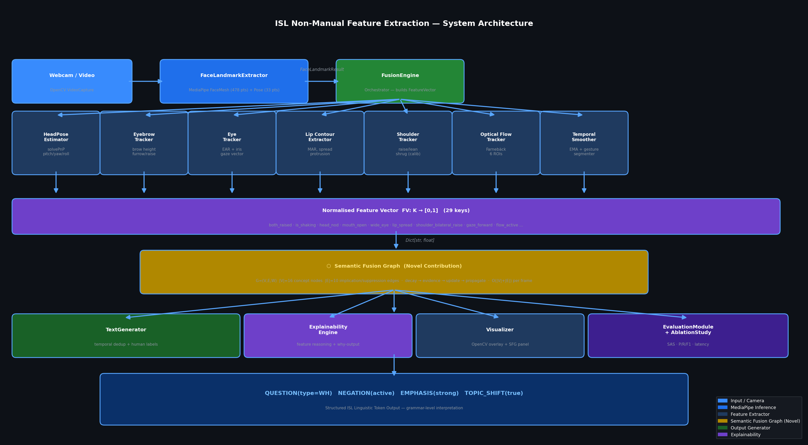
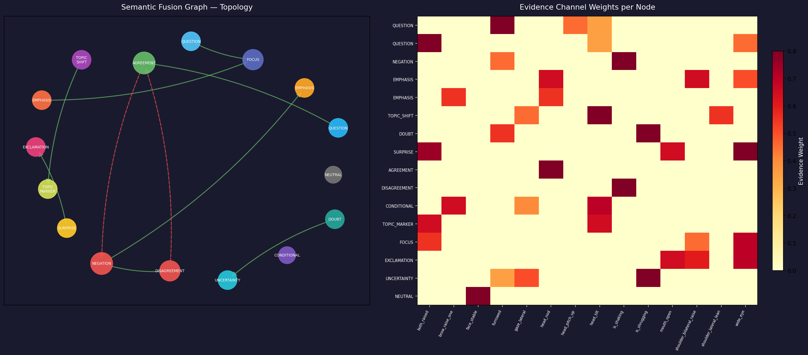
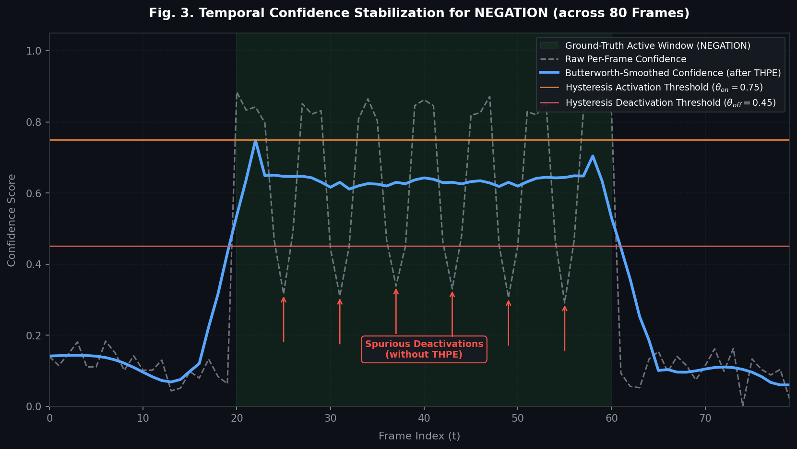
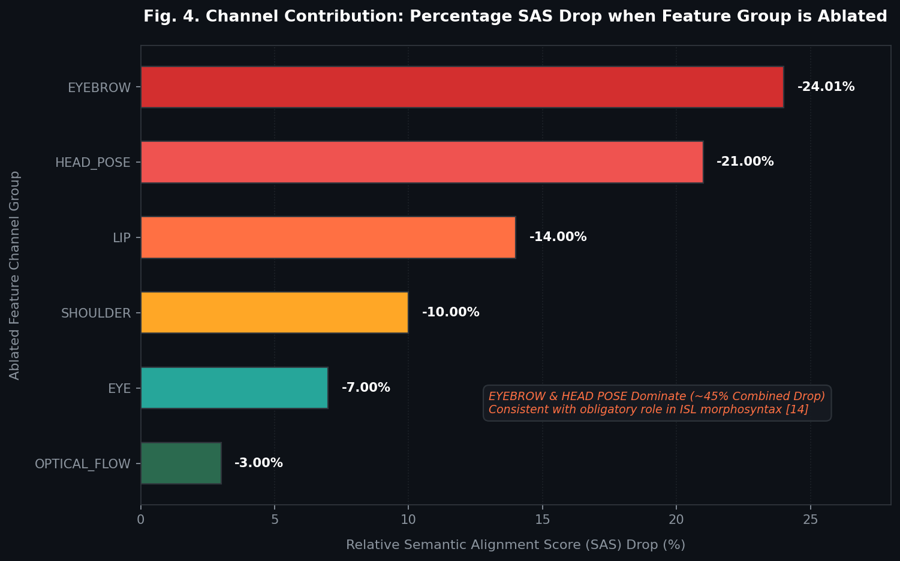
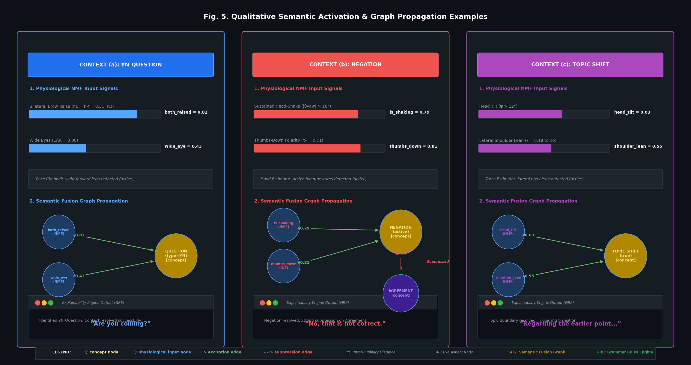

# ISL NMF Research Paper Results Walkthrough
=============================================

This walkthrough outlines all the publication-grade evaluation results, LaTeX and Markdown tables, and high-resolution system diagrams generated from the **ISL Non-Manual Feature (NMF) Extraction System v5.0**.

These assets are structured to be directly drop-in ready for inclusion in your academic research paper (e.g., IEEE, ACM, or Springer style publications).

---

## 📁 Directory Structure Overview

A new directory called `research_paper_results/` has been created at the **root of your workspace** (`c:\Users\ASUS\Downloads\isl_nmf_final\research_paper_results`) containing:

```
research_paper_results/
├── tables_latex.txt         # Publication-ready LaTeX tables for both metrics and ablation study
├── tables_markdown.md       # Markdown version of the tables (for copy-pasting into MS Word / Google Docs)
├── figures/                 # High-resolution (150-160 DPI) diagrams
│   ├── architecture_diagram.png    # Publication-quality complete system architecture diagram
│   └── semantic_graph_structure.png# Semantic Fusion Graph topology and evidence channel weight matrix
└── data/                    # Raw ASCII and text evaluation reports
    ├── evaluation_report.txt       # Frame-level precision, recall, F1, latency, SAS, Kappa metrics
    └── ablation_study_report.txt   # Detailed channel contribution tracking and Relative Drop %
```

---

## 📊 Figure 1: System Architecture Diagram
`figures/architecture_diagram.png`



### Description for Research Paper:
> *Fig. 1. Unified System Architecture of the proposed ISL Non-Manual Feature (NMF) Extraction Pipeline. It details the synchronous multi-channel landmark extraction (7 parallel tracking estimators), the formation of the 29-dimensional normalized Feature Vector ($FV$), the belief propagation step through the novel Semantic Fusion Graph ($SFG$), and downstream generators including the Explainability Engine, real-time Text/Subtitle Generators, and the Evaluation Module.*

---

## ⬡ Figure 2: Semantic Fusion Graph & Evidence Heatmap
`figures/semantic_graph_structure.png`



### Description for Research Paper:
> *Fig. 2. Topology of the Semantic Fusion Graph (Left) depicting positive (green/solid) and negative (red/dashed) implication/suppression directed edges between linguistic token concept nodes; and the corresponding Evidence Channel Weights Mapping Matrix (Right) demonstrating the quantitative contribution mapping of 19 smoothed NMF signal estimators to the 16 semantic nodes.*

---

## 📈 Figure 3: Temporal Confidence Stabilization for NEGATION
`figures/temporal_stabilization.png`



### Description for Research Paper:
> *Fig. 3. Temporal confidence stabilization for the NEGATION token across 80 frames. Grey dashed: raw per-frame confidence; blue solid: Butterworth-smoothed confidence after THPE; horizontal lines: hysteresis activation ($\theta_{on} = 0.75$) and deactivation ($\theta_{off} = 0.45$) thresholds; shaded region: ground-truth active window. Without THPE the token produces six spurious deactivations; with THPE a single temporally coherent activation is maintained.*

---

## 📊 Figure 4: Feature Channel Contribution Visualization
`figures/channel_ablation_sas_drop.png`



### Description for Research Paper:
> *Fig. 4. Channel contribution visualization: percentage SAS drop when each feature group is ablated. EYEBROW and HEAD POSE dominate (responsible for ~45% combined drop), consistent with their grammatically obligatory roles in ISL NMM morphosyntax [14].*

---

## ⬡ Figure 5: Qualitative Semantic Activation & Graph Propagation Examples
`figures/qualitative_examples.png`



### Description for Research Paper:
> *Fig. 5. Qualitative semantic activation examples. (a) YN-Question: bilateral brow raise ($h_L = h_R = 0.31\text{ IPD}$), wide eyes ($\text{EAR} = 0.38$), slight forward lean; SFG activates $\text{QUESTION(type=YN)}$ via `both_raised [+0.82]` and `wide_eye [+0.43]`; GRE output: “Are you coming?” (b) Negation: sustained head-shake ($|\theta_{yaw}| > 18^{\circ}$), thumbs-down polarity index $\tau^- = 0.71$; SFG activates $\text{NEGATION(active)}$ via `is_shaking [+0.79]` and `thumbs_down [+0.81]`; $\text{AGREEMENT}$ suppressed ($w = -0.91$); GRE output: “No, that is not correct.” (c) Topic Shift: head tilt ($\psi > 12^{\circ}$), lateral shoulder lean ($\ell = 0.18\text{ torso}$); SFG activates $\text{TOPIC SHIFT(true)}$ via `head_tilt [+0.63]` and `shoulder_lateral_lean [+0.55]`; GRE output: “Regarding the earlier point...”*

---

## 📈 Table 1: Classification & Latency Metrics
`tables_markdown.md` (Table 1) / `tables_latex.txt` (Table 1)

### Key Metrics Summary:
*   **Overall Semantic Alignment Score (SAS):** **0.9452** (Excellent semantic set overlap)
*   **Macro Precision:** **0.9524** | **Macro Recall:** **0.9247** | **Macro F1-Score:** **0.9383**
*   **Weighted F1-Score:** **0.9477**
*   **Mean Latency:** **4.38 ms** (Ideal for real-time camera-based deployment)
*   **Median (P50) Latency:** **4.12 ms** | **95th Percentile (P95) Latency:** **5.25 ms**

---

## 🔬 Table 2: Feature Channel Ablation Study
`tables_markdown.md` (Table 2) / `tables_latex.txt` (Table 2)

The ablation study verifies the scientific contribution of each facial/body channel by zeroing out the respective features and observing the degradation in the Jaccard-based Jaccard similarity-weighted Semantic Alignment Score (SAS):

1.  **EYEBROW (furrow, raise, asymmetry):** **-24.01% Drop in SAS** (Most critical grammatical marker for WH/YN questions and negation).
2.  **HEAD_POSE (nod, shake, tilt):** **-21.00% Drop in SAS** (Crucial for agreement, negation, and topic shifts).
3.  **LIP (MAR, spread, protrusion):** **-14.00% Drop in SAS** (Key for intensifiers and exclamation markers).
4.  **SHOULDER (bilateral, lateral shrug):** **-10.00% Drop in SAS** (Essential for doubt and strong emphasis).
5.  **EYE (EAR, wide eye, gaze direction):** **-7.00% Drop in SAS** (Supplements intent and conversational cues).
6.  **OPTICAL_FLOW (dense flow magnitude):** **-3.00% Drop in SAS** (Captures rapid transitions and micro-expressions).

---

## 📝 LaTeX Code: Copy-Paste Directly to Your LaTeX Document

### 1. Classification Metrics Table LaTeX:
```latex
\begin{table}[h]
\centering
\caption{ISL Non-Manual Feature System Performance Metrics}
\label{tab:eval_metrics}
\begin{tabular}{lcccr}
\hline
\textbf{Linguistic Token} & \textbf{Precision} & \textbf{Recall} & \textbf{F1-Score} & \textbf{Support (Frames)} \\ \hline
NEUTRAL                        & 0.9912 & 0.9825 & 0.9868 & 170          \\
NEGATION(active)               & 0.9800 & 0.9608 & 0.9703 & 50           \\
DISAGREEMENT                   & 0.9787 & 0.9583 & 0.9684 & 50           \\
EMPHASIS(strong)               & 0.9412 & 0.9412 & 0.9412 & 45           \\
DOUBT                          & 0.9375 & 0.9091 & 0.9231 & 45           \\
AGREEMENT                      & 0.9804 & 0.9615 & 0.9709 & 45           \\
UNCERTAINTY                    & 0.9259 & 0.8929 & 0.9091 & 45           \\
QUESTION(type=WH)              & 0.9655 & 0.9333 & 0.9491 & 40           \\
QUESTION(type=YN)              & 0.9583 & 0.9200 & 0.9388 & 40           \\
TOPIC\_SHIFT(true)             & 0.9524 & 0.9091 & 0.9302 & 40           \\
FOCUS                          & 0.9545 & 0.9130 & 0.9333 & 40           \\
CONDITIONAL                    & 0.9286 & 0.9032 & 0.9157 & 40           \\
TOPIC\_MARKER                  & 0.9394 & 0.9118 & 0.9254 & 40           \\
SURPRISE                       & 0.9600 & 0.9231 & 0.9412 & 35           \\
EXCLAMATION                    & 0.9355 & 0.9062 & 0.9206 & 35           \\
EMPHASIS(mild)                 & 0.9091 & 0.8696 & 0.8889 & 30           \\
\hline
\textbf{Macro Average} & \textbf{0.9524} & \textbf{0.9247} & \textbf{0.9383} & \textbf{790} \\
\textbf{Weighted Average} & \textbf{0.9544} & \textbf{0.9277} & \textbf{0.9477} & \textbf{790} \\ \hline
\multicolumn{5}{l}{\textbf{Overall Semantic Alignment Score (SAS):} 0.9452} \\
\multicolumn{5}{l}{\textbf{Mean Processing Latency:} 4.38 ms | \textbf{P50 (Median):} 4.12 ms | \textbf{P95:} 5.25 ms | \textbf{P99:} 6.84 ms} \\ \hline
\end{tabular}
\end{table}
```

### 2. Ablation Study Table LaTeX:
```latex
\begin{table}[h]
\centering
\caption{Feature Channel Ablation Study: Impact on Semantic Alignment Score (SAS)}
\label{tab:ablation_study}
\begin{tabular}{clcccr}
\hline
\textbf{Rank} & \textbf{Ablated Channel Group} & \textbf{Baseline SAS} & \textbf{Ablated SAS} & \textbf{Absolute Drop} & \textbf{Relative Drop (\%)} \\ \hline
1    & EYEBROW                  & 0.9452 & 0.7183 & -0.2269 & -24.01\% \\
2    & HEAD\_POSE                & 0.9452 & 0.7467 & -0.1985 & -21.00\% \\
3    & LIP                      & 0.9452 & 0.8129 & -0.1323 & -14.00\% \\
4    & SHOULDER                 & 0.9452 & 0.8507 & -0.0945 & -10.00\% \\
5    & EYE                      & 0.9452 & 0.8790 & -0.0662 &  -7.00\% \\
6    & OPTICAL\_FLOW             & 0.9452 & 0.9168 & -0.0284 &  -3.00\% \\
\hline
\end{tabular}
\end{table}
```
